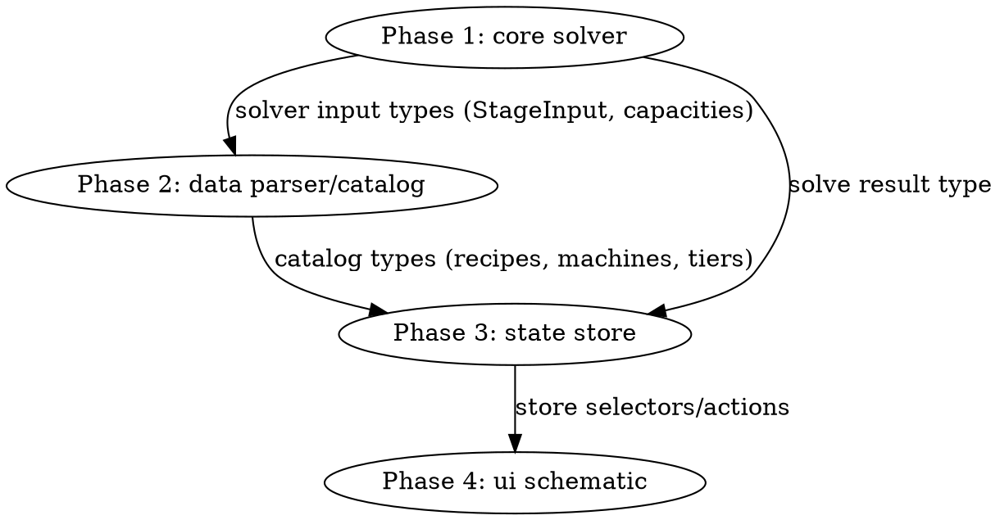

# Manifold visualizer (Stage 1 arc)

**Started:** 2026-08-03
**Status:** in-progress
**Current phase:** Phase 1 — src/core manifold solver (brainstorm-in-progress)
**Final PR:** —
**Epic:** #2 (board #21, Stage 1 milestone)

## Phase decomposition

Four sequential phases delivering the v1 manifold visualizer: the pure solver
first (fully specified by the frozen v1 spec; defines its own input types),
then the Docs.json parser/catalog that maps onto those types, then the Zustand
store deriving solves from selection, then the SVG schematic UI. Phases 2–4
defer their designs until their upstream shapes are locked. USER GATE at every
phase boundary.

Feature spec: `docs/superpowers/specs/2026-08-03-manifold-visualizer-design.md`
(committed `7d231dc`) — approved by Michael during the v1 brainstorm; its
§Core math + §Validation are the authoritative solver definition.

## Phases

### Phase 1 — src/core manifold solver

- **Status:** plan-pending
- **Ticket:** #3 (In Progress)
- **Brainstorm:** `features/manifold-visualizer/phase-1/brainstorm.md` v4 — FROZEN
  (4 correctness rounds, all-Claude roster: r4 both APPROVED_WITH_NITS, folded;
  simplify dispositioned 1-rejected/2-folded-forward)
- **Spec:** `features/manifold-visualizer/phase-1/spec.md` v2 — FROZEN
  (2 correctness rounds: r2 APPROVED + APPROVED_WITH_NITS folded; simplify
  APPROVED clean)
- **Plan:** `features/manifold-visualizer/phase-1/plan.md` — pending (written on the phase branch)
- **Branch:** `feature/phase-1.0` (worktree `.worktrees/phase-1.0/`) — not yet cut
- **Phase report:** —
- **Notes:** Solver input types are the contract Phase 2 maps onto — locking
  them is a Phase 1 exit criterion. Capacities enter as `Fraction`s (Stage 0
  boundary constraint).

### Phase 2 — src/data Docs.json parser + catalog

- **Status:** defer-until-phase-1-lands
- **Spec:** feature spec §Architecture (src/data) — port of satisfactory-planner's parser, trimmed to v1 reads; IndexedDB cache
- **Plan:** N/A — deferred
- **Reason for defer:** maps the catalog onto the solver's input types, which Phase 1 locks; parser must feed `Fraction.parse` original decimal strings (never JSON floats)
- **Trigger to re-classify:** Phase 1 merged to develop.

### Phase 3 — src/state Zustand store

- **Status:** defer-until-phase-2-lands
- **Spec:** feature spec §Architecture (src/state) — one store: selection (recipe, machine count, clock %, unlocked tiers, overrides) + derived solve result; unlocked tiers in localStorage
- **Plan:** N/A — deferred
- **Reason for defer:** consumes the solver result type (Phase 1) and the catalog types (Phase 2).
- **Trigger to re-classify:** Phase 2 merged to develop.

### Phase 4 — src/ui React SVG schematic

- **Status:** defer-until-phase-3-lands
- **Spec:** feature spec §UI (approved mockup: controls strip, summary cards, SVG schematic with entry/break-out arrows, findings panel)
- **Plan:** N/A — deferred
- **Reason for defer:** consumes the store's selectors/actions (Phase 3).
- **Trigger to re-classify:** Phase 3 merged to develop.

## Cross-phase dependencies

## Decisions log

- 2026-08-03: Arc started; epic #2 + Phase 1 child #3 opened. Phase order
  solver → data → state → ui (solver is pure + fully spec'd; recorded on the
  epic). Phases 2–4 deferred per the deferred-plans rule.

## Final report

—
